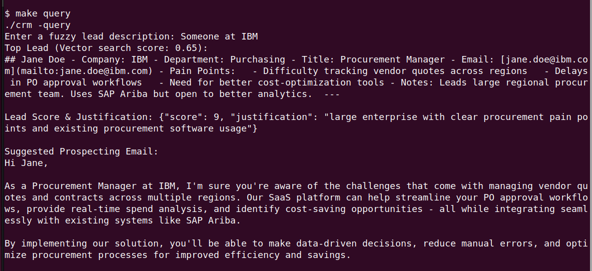

# CRM Lead Agent

CRM Lead Agent is an AI assistant for lead retrieval, scoring, and prospecting email generation.  
It uses an agent-based architecture combined with RAG to search a local vector database of leads, rank them, and provide ready-to-send email suggestions.

The system runs entirely locally using Ollama for LLM inference — ensuring privacy and security with no external API calls.

Project uses [langchaingo](https://github.com/tmc/langchaingo) library.

---

## Features

- Fuzzy lead search with vector embeddings
- Automated lead filtering and ranking
- AI-generated prospecting emails
- Local LLM execution — no API keys required
- CLI and optional web interface
- Fully self-contained using Docker for dependencies

---

## How it Works

1. Markdown source data of leads and company product is embedded and stored in a Chroma vector store.
2. The agent pipeline:
   - Filters relevant leads based on a query
   - Searches the vector store for matches
   - Scores and ranks the best lead
   - Generates a suggested email for outreach
3. The LLM and embedding models are served locally through Ollama.

<p align="center">
  
</p>

---

## Requirements

- Docker & Docker Compose
- Go 1.21+
- Node.js & npm (optional, for web UI)

---

## Installation & Setup

Clone the repository:

```bash
git clone https://github.com/nebojsaj1726/crm-agent.git
cd crm-agent
```

Create .env file

Build and setup the environment:

`make setup`

This will:

- Start Docker containers for Ollama and Chroma

- Pull the LLM and embedding models

- Seed the vector store with sample leads

---

## Usage

`make query`

This will:

- Prompt for a fuzzy lead description

- Return the top match, a lead score with reasoning, and a draft prospecting email

Optionally, you can open web UI in browser on localhost with:

`make web`

### Performance Notes

- On CPU-only systems, responses may take up to 1–2 minutes for large models.

- For <30 second responses, a GPU with sufficient VRAM is recommended.
